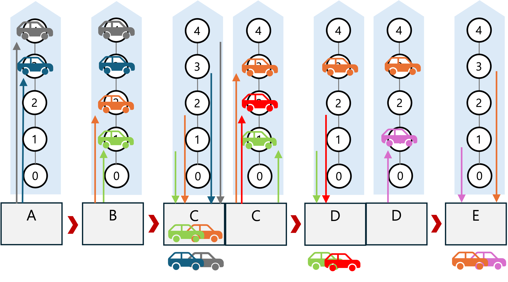
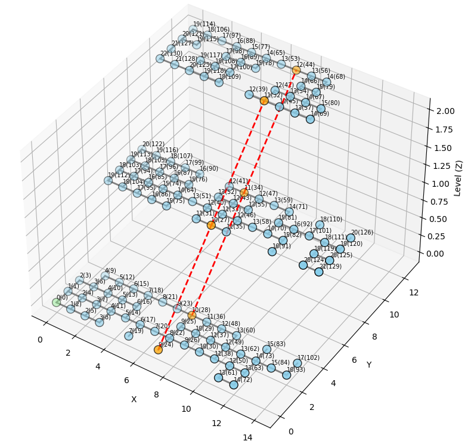
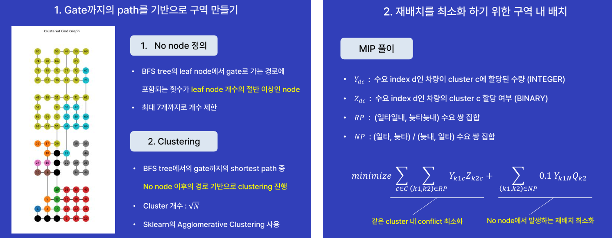

# OPTIMIZATION GRAND CHALLENGE 2025 — Roll-on Roll-off Optimization

> 2025 Optimization Grand Challenge · Team FORRORO (서울대학교 공급망관리 연구실)  
> **10위 / 343팀**

[](https://optichallenge.com/)

수학적 최적화를 통해 RO-RO(Roll-on Roll-off) 선박의 **강제 하역 횟수를 최소화**하는 알고리즘을 설계했습니다.  
Clustering 기반 초기 배치 → MILP 풀이 → Heuristic 경로 최적화의 3단계 파이프라인으로 구성됩니다.

---

## 문제 정의

RO-RO 선박은 여러 항구를 경유하며 차량을 싣고 내리는데, 나중에 하역할 차량이 먼저 실린 차량을 가로막는 경우 **강제 하역(Forced Unloading)** 이 발생합니다.  
이 문제는 Multiport Container Ship Stowage Problem을 변형한 형태로, 미리 정해진 bay 구조가 없어 기존 연구를 바로 적용할 수 없습니다.

<p align="left">
  
  
</p>

---

## 알고리즘 구조

```
Clustering을 활용한 초기 배치 결정
          ↓
재배치 비용 최소화를 위한 MILP 풀이
          ↓
Heuristic을 이용한 실제 적재/하역 경로 최적화
```

### 1단계 — Clustering 기반 초기 배치

<p align="left">
  
</p>

- **No node 정의**: BFS tree의 leaf node에서 gate로 가는 경로에 포함 횟수가 leaf node 개수의 절반 이상인 node (최대 7개 제한)
- **Clustering**: No node 이후의 경로 기반으로 √N개의 cluster 구성 (Sklearn Agglomerative Clustering)

### 2단계 — MILP 풀이 (재배치 최소화)

목적함수는 같은 cluster 내 conflict 최소화와 No node에서 발생하는 재배치를 동시에 최소화합니다.

$$minimize \sum_{c \in C} \sum_{(k_1,k_2) \in RP} Y_{k_1 c} Z_{k_2 c} + \sum_{(k_1,k_2) \in NP} 0.1 \, Y_{k_1 N} Q_{k_2}$$

| 결정변수 | 설명                                                    |
| -------- | ------------------------------------------------------- |
| $Y_{dc}$ | 수요 index d인 차량이 cluster c에 할당된 수량 (INTEGER) |
| $Z_{dc}$ | 수요 index d인 차량의 cluster c 할당 여부 (BINARY)      |

### 3단계 — Heuristic 경로 최적화

강제 하역 횟수를 최소화하는 적재/하역 경로를 선택합니다.

1. 차량이 점유하고 있는 node에 연결된 edge들의 가중치 수정
2. 하역 시 강제 하역 필수 여부 확인 (gate에 가까운 순으로 강제 하역 vs 기타 노드로 대피 선택)
3. 강제 하역된 차량 재배치 시 Penalty 항목 적용 (추후 충돌 방지)

---

## 구현

- 언어: **Python** (default, CPU 1개)
- Solver: **Gurobi**

```bash
python main.py          # 전체 알고리즘 실행
python solution_evaluator.py   # 솔루션 평가
```

---

## Team

| 이름   | 소속                         |
| ------ | ---------------------------- |
| 강세정 | 서울대학교 공급망관리 연구실 |
| 이소현 | 서울대학교 공급망관리 연구실 |

---

## 향후 발전 방향

- 하드코딩 요소의 일반화 및 확장성 확보 (MILP 모형 내 상수 → 데이터 기반 파라미터)
- MILP 모형의 충돌 정의 고도화 (대체 경로 고려)
- 초기 배치 휴리스틱 다각화 (Clustering 외 다양한 휴리스틱 적용)

---

## Tech Stack

`Python` `Gurobi` `MILP` `Heuristic` `Scikit-learn`
