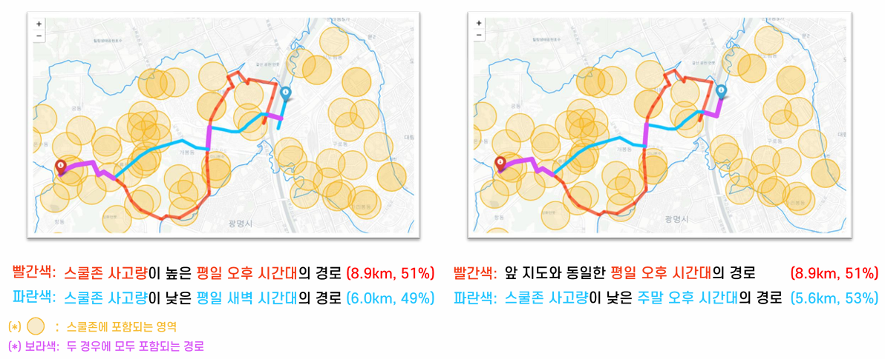

# 스쿨존 위험도를 고려한 내비게이션 경로설정

> 최적화 프로젝트  
> **2020 대한산업공학회 대학생 프로젝트 경진대회 2위 수상**

<details>
  <summary>수상 내역 확인</summary>
  <br>
  
</details>

<p align="left">
  
</p>

기존 스쿨존 내비게이션은 스쿨존을 무조건 회피하거나 무조건 통과하는 극단적인 방식을 취합니다.  
본 프로젝트는 **효율성(시간)과 안전성(스쿨존 사고 위험)을 동시에 고려**하고, **시간 구역별로 위험도를 다르게 인지**하는 새로운 내비게이션 알고리즘을 제안합니다.

---

## 연구 배경

- 스쿨존 내 안전시설 미흡으로 판명난 곳이 전체의 **80%** 에 달해 어린이 교통사고가 지속 발생
- 민식이법 제정 이후 스쿨존 회피 내비게이션에 대한 운전자 요구 급증
- 그러나 기존 스쿨존 내비게이션은 하루 종일 동일한 위험도를 적용 → 어린이 교통사고가 거의 없는 새벽에도 우회

**→ 시간대별로 위험도를 다르게 적용하고, 사용자 선호에 따라 안전성·효율성을 조절하는 내비게이션 제안**

---

## 연구 흐름

```
표본 지역(구로구) 주요 지점·도로를 노드·링크로 정리
            ↓
  스쿨존 위험도 가중치(a, b, c) 도출
            ↓
  IP 모델 수립 + Dijkstra's Algorithm 적용
            ↓
  사용자 선호도(x:안전성, y:효율성)에 따른 최적 경로 안내
```

---

## 모델 설계

### 스쿨존 위험도 가중치 구성요소

| 파라미터  | 설명                             | 산출 방법                                               |
| --------- | -------------------------------- | ------------------------------------------------------- |
| $a_{ij}$  | 경로 구간별 스쿨존 빈도          | 링크 출발·도착 노드의 위경도로 haversine 공식 적용      |
| $b_{ijt}$ | 시간 구역별 교통량               | 주행속도의 역수 (네이버맵 API 2달간 평균)               |
| $c_t$     | 시간 구역별 스쿨존 교통사고 빈도 | TAAS 2017~2019년 어린이 교통사고 데이터 → 8개 시간 구역 |

### 목적함수 (IP)

$$minimize \; z = \sum_i \sum_j \left[ T_{ij} \{(1+a_{ij})(1+c_t)\}^x \times (1+b_{ij})^y \right] \times X_{ij}$$

- $x$: 안전성 가중치 (사용자 설정)
- $y$: 효율성 가중치 (사용자 설정)

---

## 결과

<table>
<tr>
<th>안전성 가중치 변화</th>
<th>효율성 가중치 변화</th>
</tr>
<tr>
<td>안전성을 높이면 스쿨존을 더 많이 우회 (12.9km, 39.3%)</td>
<td>효율성을 높이면 스쿨존을 더 많이 통과 (7.6km, 55.3%)</td>
</tr>
</table>

**새로운 내비게이션**: 안전성·효율성 가중치를 균형 있게 조절한 경우 **8.5km, 36.5%** — 기존 두 극단의 중간 경로 안내

또한, 동일한 가중치에서도 **시간에 따라 경로가 달라지는** 것을 확인:

- 스쿨존 사고량이 높은 평일 오후: 8.9km, 51% (더 많이 우회)
- 스쿨존 사고량이 낮은 평일 새벽: 6.0km, 49% (더 직접 경로)

---

## 적용 가능성

- 스쿨존뿐 아니라 노인보호구역, 사고다발구역 등 **다양한 위험구역으로 확장** 가능
- **자율주행** 영역에서 위험지역 우회 경로 설정 핵심 장치로 활용 가능

---

## Team

강세정, 김민아, 신재욱, 이성민, 이수연, 장현우

---

## Tech Stack

`Python` `ArcGIS` `Naver Maps API` `Dijkstra's Algorithm` `Integer Programming` `OPL (CPLEX)`
