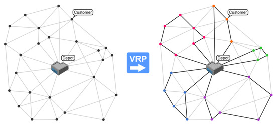

# 유전 알고리즘을 활용한 차량 경로 최적화

> 2023 CJ대한통운 미래기술챌린지 · Team IECS

<p align="left">
  
</p>

다양한 시간·용량 제약 조건 아래서 **유전 알고리즘(Genetic Algorithm)** 을 적용해  
CJ대한통운의 **차량 경로 문제(VRP)** 를 풀고, 배송 비용을 최소화하는 솔루션을 제안했습니다.

---

## 문제 정의

- 여러 터미널에서 출발하는 차량이 시간 윈도우(time window) 내에 배송지를 방문해야 함
- 차량별 CBM(용량) 제약 존재
- 매 time_batch(2~6시간 단위)마다 새 주문이 들어오는 동적 환경
- 미처리 주문은 다음 배치로 이월, 터미널 간 차량 재배치도 고려

---

## 알고리즘 구조

### Genetic Algorithm 흐름

```
Initialization  →  Fitness Evaluation  →  Selection (Roulette Wheel)
     ↑                                              ↓
Replacement  ←  Mutation (Swap/Insertion)  ←  Crossover
     ↓
Until T generations
```

- **초기해**: 차량 CBM 제약을 만족하는 random individual 생성
- **Selection**: Roulette Wheel 방식 (fitness 비례 확률 sampling)
- **Crossover**: 부모 individual 간 breeding으로 offspring 생성
- **Mutation**: Swap + Insertion 연산으로 다양성 유지 및 local minima 탈출

### 최적 파라미터

| 파라미터        | 값  |
| --------------- | --- |
| mutation_rate   | 0.2 |
| elite           | 10  |
| population_size | 100 |
| generations     | 100 |

---

## 코드 구조

| 파일       | 역할                                                   |
| ---------- | ------------------------------------------------------ |
| `main.py`  | day, time_batch, terminal 루프 실행 · GA 파라미터 설정 |
| `pyVRP.py` | Genetic Algorithm VRP 핵심 로직                        |
| `eval.py`  | 거리·시간·용량·비용 계산 보조 함수                     |
| `utils.py` | Plotting, 데이터 전처리, 차량 재배치 로직              |

---

## 차량 재배치 (Reallocate)

매 time_batch 종료 시 실행되며, 미처리 주문이 있는 터미널에 인근 터미널의 여유 차량을 배정합니다.

- 미처리 주문이 있는 터미널 탐색
- 인근 터미널 순으로 여유 차량 확인 (min_car 하한선 기준)
- 여유분 차량을 random sampling하여 재배치

---

## 실행 방법

```bash
pip install -r requirements.txt
python main.py
```

결과 파일은 `./결과` 폴더에 생성됩니다. `main.py`에서 `FOLDER_PATH` 변수로 출력 경로를 설정할 수 있습니다.

---

## Team

| 이름   | 역할                  |
| ------ | --------------------- |
| 강세정 | 알고리즘 설계 및 구현 |
| 장현우 | 알고리즘 설계 및 구현 |
| 장동현 | 알고리즘 설계 및 구현 |
| 최세연 | 알고리즘 설계 및 구현 |

---

## Tech Stack

`Python 3.9` `Genetic Algorithm` `Vehicle Routing Problem (VRP)`

---

## Reference

Baker, B. et al, 2003, _A Genetic Algorithm for Vehicle Routing Problem_, Computers & Operations Research 30 (2003) 787–800.
