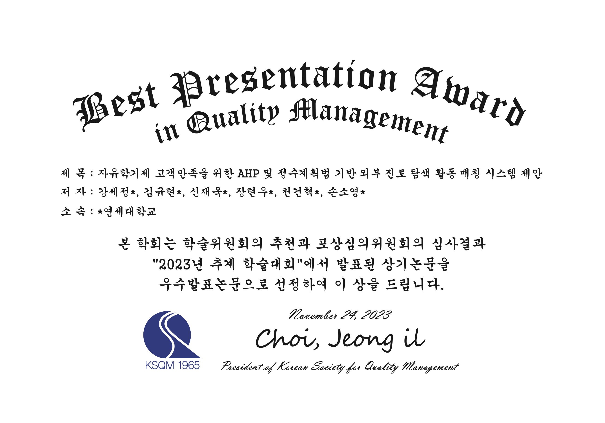
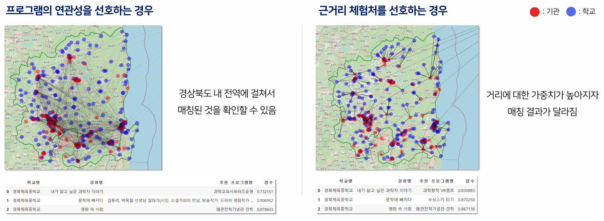
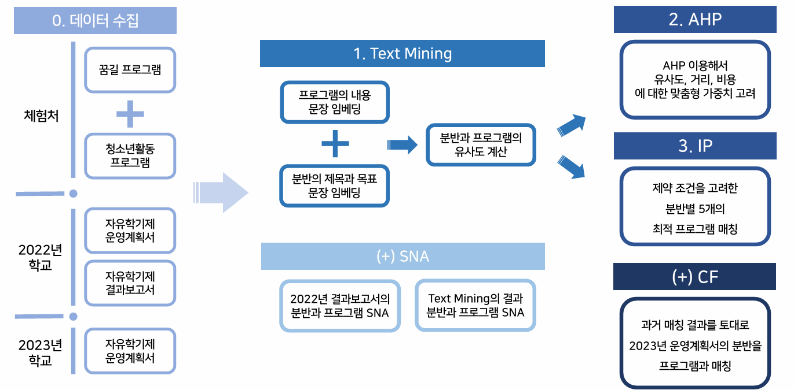
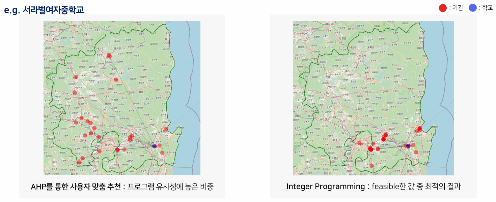

# 자유학기제 고객만족을 위한 AHP 및 정수계획법 기반 외부 진로 탐색 활동 매칭 시스템

> Data Mining Theory and Application (IIE 4102) — Term Project  
> **2023 한국품질경영학회 추계학술대회 우수발표논문상**

  
수상 내역 확인

   
  

  

자유학기제 외부 체험활동 인프라가 가장 열악한 **경상북도 지역**을 대상으로,  
학교별 학생의 니즈와 외부 체험처의 특성을 매칭하는 시스템을 **Text Mining + AHP + IP** 조합으로 제안합니다.

---

## 문제 의식

자유학기제는 중학생이 진로와 관련된 다양한 체험활동을 하도록 설계된 제도이지만, 현실은:

1. **지역별 컨텐츠·전문 인력 편차 심화** — 지역 특화 가이드라인 부재, 외부 체험처 불균형
2. **진로 탐색 의의 퇴색** — 학교 내 자체 프로그램으로만 운영되는 경우가 다수
3. **학습 결손 발생** — 시험이 없어 학습 동기가 약해지는 부작용

**→ 학교의 니즈와 외부 기관의 공급을 Text Mining으로 매칭, 거리·비용·연관성을 동시에 최적화**

---

## 데이터

| 데이터                            | 출처                        | 내용                         |
| --------------------------------- | --------------------------- | ---------------------------- |
| 자유학기제 운영계획서 (2022·2023) | 전국 중학교 공시정보 알리미 | 분반별 주제·목표 텍스트      |
| 외부 체험활동 결과보고서          | 교육기부 포털               | 358개 기관 프로그램 정보     |
| 학교·기관 위치 데이터             | 공공데이터포털              | 경상북도 264개 중학교 위경도 |

---

## 방법론

  

### Text Mining

- **LDA**: 기본 전처리(특수기호 제거) 후 토픽 추출
- **Ko-Sentence RoBERTa**: 카카오브레인의 KorNLU 데이터셋으로 fine-tuning된 모델로 문장 간 유사도 측정

### AHP 분석

- 외부 프로그램 선정 주요 요인: **연관성(0.48), 거리(0.31), 비용(0.21)**
- 세 요인의 쌍대 비교 데이터로 상대적 중요도 산출

### IP 모델 (0-1 Knapsack 변형)

$$maximize \; z = \sum X_i \times v_i$$

| 기호  | 설명                         |
| ----- | ---------------------------- |
| $X_i$ | 프로그램 선택 여부 (Boolean) |
| $v_i$ | 프로그램 유사도 점수         |
| $B$   | 분반 예산                    |
| $d_i$ | 체험처까지의 거리 (km)       |

**제약조건**: 최대 5개 추천, 총 비용 ≤ 예산, 거리 제한, 분반별 최대 학생 수 준수

---

## 결과

  

- AHP 기반 사용자 맞춤 추천: 학교별 선호도를 반영한 다양한 체험처 매칭
- IP 기반 최적 추천: 예산·거리 제약 내에서 feasible한 최적 프로그램 5개 추천
- SNA 결과: 기존 대비 **중심 기관의 편중성 감소** — 다양한 기관이 추천됨

---

## 기대 효과

- 지역 진로 탐색 격차 해소: 외부 인프라가 부족한 지역 학교에도 적합한 체험 활동 추천
- 자율주행 등 User-based 협업 필터링으로 유사 분반 추천으로 확장 가능

---

## Team

| 이름   |
| ------ |
| 강세정 |
| 신재욱 |
| 장현우 |

---

## Tech Stack

`Python` `LDA` `Ko-Sentence RoBERTa` `AHP` `Integer Programming (Dynamic Programming)` `SNA` `Folium`
