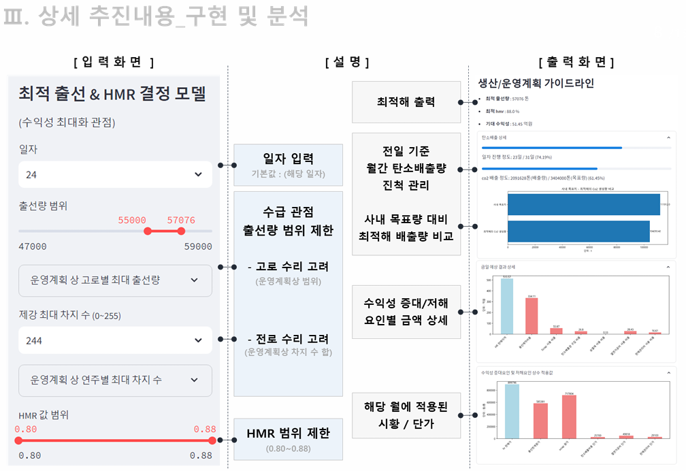

# 최적 출선량 및 HMR 결정 모델을 통한 광양소 수익성 극대화 방안 검토

> POSCO 생산기술부 현장실습 산출물 (2024.01 – 2024.02)

  

포스코 광양제철소의 **출선량**과 **HMR(Hot Metal Ratio)** 을 동시에 결정하는 수리 최적화 모델을 개발하여, 수익성 극대화를 위한 생산계획 수립을 지원합니다.  
현업 부서에서 바로 활용할 수 있도록 **Excel 연동 UI**로 제작·배포되었습니다.

---

## 배경

제철소 수익성은 출선량(용선 생산량)과 HMR(전로 장입 시 용선 비율)에 크게 좌우됩니다.  
두 변수는 고로 수리 일정, 전로 차지 수, 탄소 배출 목표 등 복잡한 제약 조건 아래에서 동시에 결정되어야 하며, 기존에는 담당자의 경험에 의존한 수동 계획이 이루어지고 있었습니다.

---

## 모델 구조

수익성에 영향을 미치는 주요 요인을 정량화하고, 이를 목적함수로 설정한 **수리 최적화 모델(MIP)** 을 구축했습니다.

- **결정변수**: 일별 최적 출선량, HMR 값
- **제약조건**: 고로 수리 일정 반영, 전로 차지 수 제한, 수급 관점 출선량 범위, HMR 운영 범위 (0.80 ~ 0.88)
- **목적함수**: 수익성 증대 요인의 합 최대화 (탄소배출 페널티 포함)

---

## 사용자 화면

> 입력값을 설정하면 최적 출선량·HMR을 즉시 산출하고, 수익 분석 결과를 시각화합니다.

| 구분     | 내용                                                                                   |
| -------- | -------------------------------------------------------------------------------------- |
| **입력** | 일자, 출선량 범위 슬라이더, 제강 최대 차지 수, HMR 범위 슬라이더                       |
| **출력** | 최적 출선량·HMR, 기대 수익성, 월간 탄소배출량 진척 관리, 수익 증대/저해 요인 금액 상세 |

---

## 주요 기여

- 수리 모형 기반 생산계획 수립으로 정량적 개선 효과 산출
- 현업 부서 활용이 가능한 **Excel 연동 UI** 제작 및 배포 → 업무 효율화

---

## Tech Stack

`Python` `Excel (VBA)` `Mathematical Programming (MIP)`
