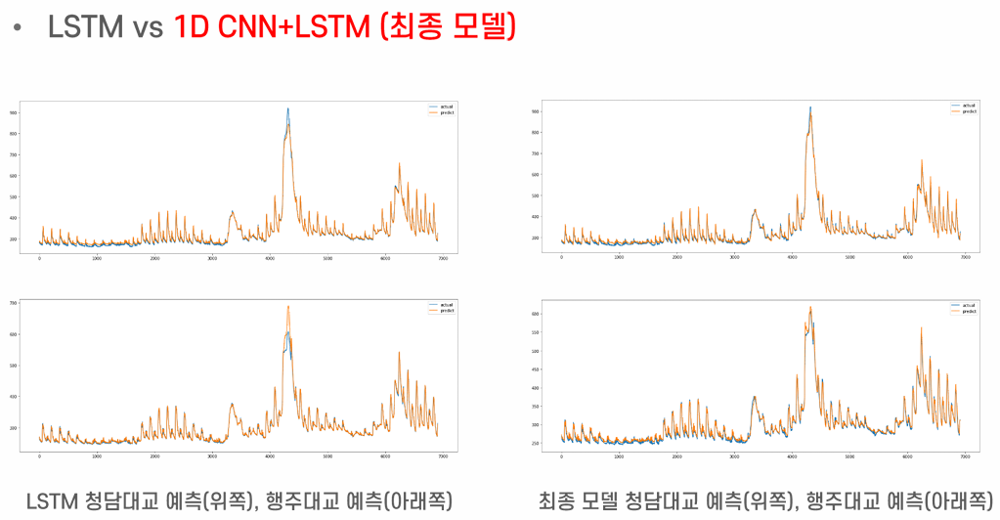

# CNN-LSTM을 활용한 한강 수위 예측 모델

> YBIGTA 21기 신입기수 프로젝트  
> **팔당댐 홍수 안전운영에 따른 한강 수위예측 AI 경진대회 · Private Score 19위 / 308팀**

[](https://dacon.io/competitions/official/235949/overview/description)

<p align="left">
  
</p>

팔당댐 방류에 따른 서울시내 한강 주요 다리(청담대교, 잠수교, 한강대교, 행주대교)의 수위를 예측하는 딥러닝 모델을 설계했습니다.  
TensorFlow 기반의 **1D CNN + LSTM** 하이브리드 구조를 최종 모델로 채택했으며, 결측치 처리부터 파생변수 생성까지 전처리 파이프라인을 직접 구축했습니다.

---

## 대회 배경

- 팔당댐 홍수 안전운영에 따른 서울시내 한강 주요 지점의 수위를 예측
- 홍수 재해로 인한 피해를 미연에 방지하고 최소화하는 것을 목표로 함
- 평가 기준: **RMSE / R_Squared_Score**

---

## 데이터

| 데이터                | 내용                                                                         |
| --------------------- | ---------------------------------------------------------------------------- |
| 팔당댐 데이터         | 현재수위, 유입량, 저수량, 공용량, 방류량                                     |
| 한강 다리 유량 데이터 | 강화대교 조위, 청담대교·잠수교·한강대교·행주대교 유량                        |
| 강수량 데이터         | 대곡교·진관교·송정동 강수량                                                  |
| 한강 다리 수위 데이터 | 청담대교·잠수교·한강대교·행주대교 수위 **(Target)**                          |
| 외부 데이터           | 서울시 강수량(기상청), 광진교 수위, 연도별 4월 데이터(한강홍수통제소 크롤링) |

---

## 프로세스

```
Data (Water / RainFall / 외부 데이터)
        ↓
결측치 처리 [1단계] — 팔당댐 데이터·강화대교 조위: SARIMA
        ↓
결측치 처리 [2단계] — 다리 수위·유량: Multivariate CNN-LSTM
        ↓
파생변수 생성 — 강화대교·팔당댐까지의 거리(상관계수 분석으로 시간차 도출)
        ↓
Experiments (ML: RandomForest / ExtraTrees / XGBoost → Feature Importance 추출)
        ↓
Model (1D CNN / LSTM / 1D CNN+LSTM)
```

---

## 모델 구조

TensorFlow 기반으로 **1D CNN + LSTM** 구조를 구축했습니다.  
CNN이 시계열의 지역 패턴을 추출하고, LSTM이 시간 의존성을 학습합니다.

```
Conv1D → Flatten → RepeatVector → LSTM_1 → LSTM_2 → Dense → Dense_1
```

- `RepeatVector`: Flatten의 output을 3D Tensor로 변환하여 LSTM 입력 형태로 맞춤
- 최종 출력: 청담대교, 잠수교, 한강대교, 행주대교 수위 예측값 (4개)

### 하이퍼파라미터 튜닝 기준

| 파라미터               | 값                              |
| ---------------------- | ------------------------------- |
| learning_rate          | max 0.01, scheduler(patience=3) |
| iteration (batch size) | 1000                            |
| epoch                  | 100                             |
| early_stopping         | 10                              |

---

## 실험 결과

| 모델                     | 특징                                  |
| ------------------------ | ------------------------------------- |
| 1D CNN                   | 비교적 빠른 수렴, 일부 구간 예측 미흡 |
| LSTM                     | 트렌드 추적은 좋으나 피크 예측 불안정 |
| **1D CNN + LSTM (최종)** | 피크 및 트렌드 모두 개선된 성능       |

Baseline (ARIMA) 대비 RMSE 대폭 개선:

| 지점     | ARIMA RMSE |
| -------- | ---------- |
| 청담대교 | 106.28     |
| 잠수교   | 90.884     |
| 한강대교 | 91.077     |
| 행주대교 | 70.401     |

---

## 한계 및 향후 발전 방향

- **Limitation**: Forecast length를 더 길게 잡아야 실용적 유용성 증가, 리소스 부족으로 데이터셋 활용에 제약
- **Future Work**:
  - 사전 학습된 모델(pre-trained model) fine-tuning을 통한 성능 향상
  - XAI(설명 가능 AI)를 통한 딥러닝 모델 내부 해석
  - 한강 수위와 밀접한 외부 데이터 추가 확보 (지류, 국소지역 강수량 등)

---

## Team

강세정, 박유찬, 이다영, 이예림

---

## Tech Stack

`Python` `TensorFlow` `CNN-LSTM` `SARIMA` `SHAP` `scikit-learn` `XGBoost`
