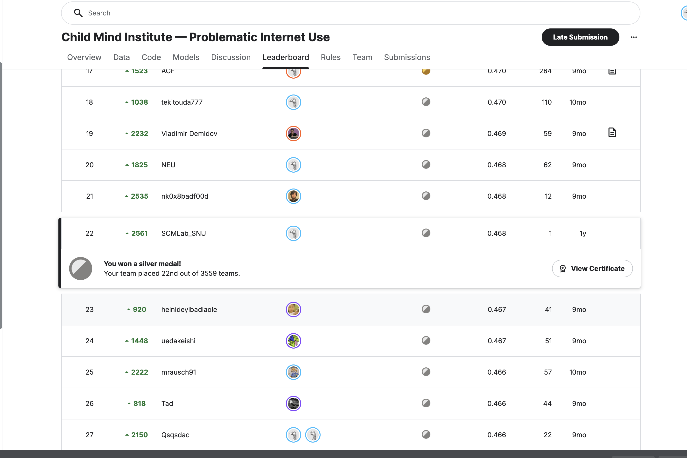
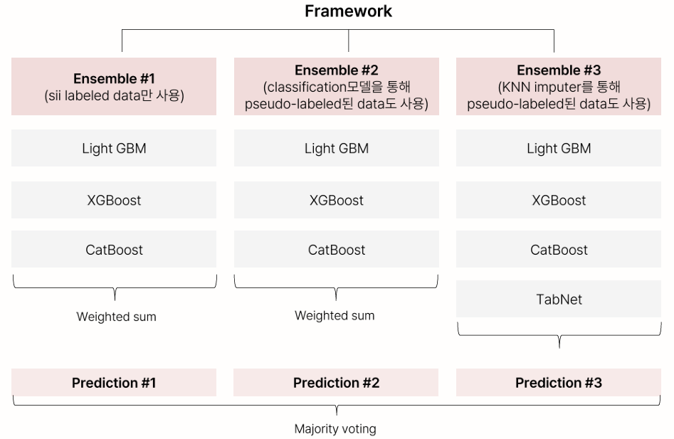

# Child Mind Institute — Problematic Internet Use

> 데이터마이닝기법 프로젝트  
> **Kaggle — Child Mind Institute: Problematic Internet Use · 22위 / 3,559팀**

[](https://www.kaggle.com/competitions/child-mind-institute-problematic-internet-use)

<details>
  <summary>대회 결과 확인</summary>
  <br>
  
</details>

<p align="left">
  
</p>

아동·청소년의 신체 활동 및 인터넷 사용 행태 데이터를 기반으로  
**인터넷 중독 심각도 지수(SII, Severity Impairment Index)** 를 예측하는 머신러닝 파이프라인을 구축했습니다.

---

## 대회 개요

| 항목        | 내용                                                                                        |
| ----------- | ------------------------------------------------------------------------------------------- |
| 주최        | Child Mind Institute (Kaggle)                                                               |
| 목표        | Parent-Child Internet Addiction Test 기반 SII 예측                                          |
| 입력 데이터 | 신체 활동 데이터 (Physical Activity, BIA 등) + 인터넷 사용 행태 데이터 + 시계열 활동 데이터 |
| 주요 과제   | 결측치 보강 / Target missing 처리 / 시계열 데이터 피처화                                    |

---

## 주요 과제 및 접근법

```
중간발표까지:
  EDA → 결측치 보강 → 시계열 light feature로 '규칙성' 지표 도출

          ↓ 문제: 레이블 있는 데이터 수 적음, unlabeled 데이터 다수

1st Round: Ensemble 모델 확장 (3개 이상 앙상블 → majority voting)

2nd Round: 준지도학습 — pseudo-labeling 시도
  방법 1 (KNN impute): KNN으로 sii pseudo-labeling
  방법 2 (분류 모델): 0 vs (1,2,3) → 1 vs (2,3) → 2 vs 3 순차 분류 후 pseudo-labeling

3rd Round: 시계열 데이터 내 추가 지표 구상
  수면 관련 feature (Sleep Duration, 수면 표준편차 등) 도입
```

---

## Framework

3개의 앙상블을 병렬로 구성하고, 최종적으로 Majority Voting을 수행합니다.

> 모든 모델은 **회귀 모형**으로 sii 값을 연속된 값으로 예측한 후 반올림

---

## 전처리

- 16개 열 제거: season feature 11개, 악력 측정 feature 4개, fitness endurance time-sec
- 인터넷 사용시간이 severe하나 부모 응답 total 점수가 0인 이상 데이터 제거
- IQR을 이용한 이상치 제거 및 시각화 검증
- BIA 데이터(16차원)를 **Auto-Encoder로 2차원 축소** (null 없는 데이터로 학습)

---

## 3rd Round: 시계열 수면 지표 도입

Pittsburgh Sleep Quality Index(PSQI)의 **Sleep Duration** 구성요소에 주목하여,  
시계열 light 데이터로부터 수면 관련 feature를 직접 추출했습니다.

- 이전 Kaggle 대회(Child Mind Institute - Detect Sleep States)의 1D CNN UNet 모델 활용
- 시계열 데이터 → Sleep/Wake 분류 → 수면 구간 추출
- 도출된 지표: **Day별 수면시간 표준편차**, **Day별 수면시간 4분위값**

### Feature Importance (LGBM 기준 상위 지표)

```
sleep_std_dev > sleep_q1 > regularity_index > Fitness_Endurance_Time_Mins > sleep_q2 > ...
```

---

## Validation Score 비교

| 모델 구성                       | LightGBM   | XGBoost    | CatBoost   |
| ------------------------------- | ---------- | ---------- | ---------- |
| Model 1 (sii labeled only)      | 0.4827     | 0.4746     | 0.4766     |
| Model 2 (KNN pseudo-label)      | 0.512      | 0.5109     | 0.511      |
| **Model 3 (분류 pseudo-label)** | **0.5843** | **0.5827** | **0.5927** |

---

## Lessons Learned

- 공모전을 계기로 다양한 시계열 데이터를 적용하며 실무 경험 쌓음
- 여러 개의 앙상블을 구축하는 모델도 다루며 데이터마이닝 기법에 대한 이해와 흥미 향상
- 준지도학습을 실제 수업에서 다룬 내용과 연결해 적용하며 모델 성능 향상 및 성취감 달성

---

## Team

강세정, 이소현, 박효훈, 김한별

---

## Tech Stack

`Python` `LightGBM` `XGBoost` `CatBoost` `TabNet` `TensorFlow` `scikit-learn` `Auto-Encoder` `Pseudo-Labeling`
