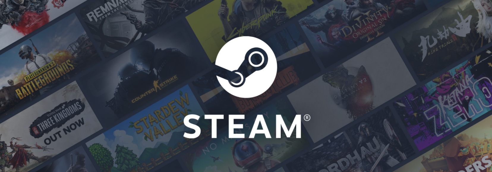
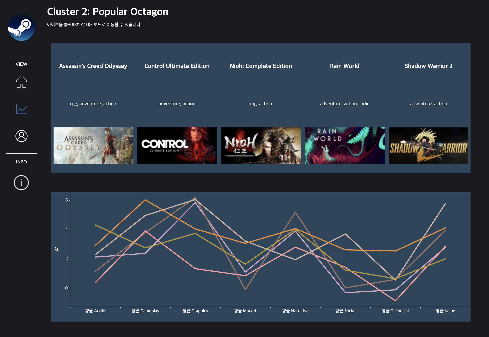

# STEAM 게임 시장 분석 및 추천시스템

> YBIGTA 데이터분석팀 프로젝트

<p align="left">
  
</p>

STEAM의 대규모 유저·리뷰 데이터를 활용해 게임 시장을 분석하고,  
기존 플레이타임 중심 추천시스템의 한계를 보완하는 **감성 기반 개인화 추천시스템**을 개발했습니다.

---

## 문제 의식

기존 STEAM 추천시스템은 유저의 플레이타임만을 기준으로 게임을 추천합니다.  
그러나 오래 플레이했다고 해서 반드시 그 게임을 좋아한다고 볼 수 없습니다.  
본 프로젝트는 유저의 **리뷰 감성(Aspect-Based Sentiment)**을 반영하여 보다 정교한 추천 기준을 수립하는 것을 목표로 했습니다.

---

## 분석 흐름

```
데이터 수집 (STEAM API)
        ↓
텍스트 전처리 및 ABSA (8개 감성 측면 분석)
        ↓
유저별 리뷰 체인 생성 (플레이타임 누적 기반)
        ↓
k-means 클러스터링 (8개 클러스터 도출)
        ↓
SASRec 기반 다음 게임 추천
        ↓
Tableau 대시보드 시각화
```

---

## 방법론

### (1) 데이터 수집

- STEAM API를 활용하여 게임 및 유저 관련 데이터 수집

### (2) 감성 분석 — Aspect-Based Sentiment Analysis

- 모델: **[DeBERTa-v3-base ABSA](https://huggingface.co/yangheng/deberta-v3-base-absa-v1.1)**
- 8개 감성 측면 분석: Gameplay, Market, Social, Narrative, Graphics, Technical, Value, Audio
- 유저의 누적 플레이타임을 반영한 리뷰 체인 생성

### (3) 클러스터링

- **k-means** 클러스터링으로 감성 기반 새로운 게임 분류 기준 도출
- 8개 클러스터 도출: insignificant 1, technical deficiency, popular octagon, social interaction, insignificant 2, not bad, immersive audio, slight technical deficiency

### (4) 추천 모델

- **[SASRec](https://github.com/kang205/SASRec)** (Self-Attentive Sequential Recommendation) 을 활용한 다음 게임 추천

### (5) 시각화

- Tableau를 활용한 게임 시장 대시보드 구축
- [**대시보드 바로가기 🎮**](https://public.tableau.com/app/profile/eunsuh.kim/viz/SteamGameMarketAnalysis/SteamDashboard0)

<p align="left">
  
</p>

---

## Team

| 이름   | GitHub                                         | Email                   |
| ------ | ---------------------------------------------- | ----------------------- |
| 강세정 | [@SEJEONGKANG](https://github.com/SEJEONGKANG) | sjkang6870@yonsei.ac.kr |
| 김소정 | [@ssokeem](https://github.com/ssokeem)         | kimsojeong@yonsei.ac.kr |
| 김은서 | [@eunsuh-kim](https://github.com/eunsuh-kim)   | eunsuhkim1@gmail.com    |
| 박유찬 | [@chanchanuu](https://github.com/chanchanuu)   | ucp6237@gmail.com       |
| 장동현 | [@rroyc20](https://github.com/rroyc20)         | rroyc20@gmail.com       |

---

## More Information

> [**Notion**](https://www.notion.so/eunsuh-kim/Steam-43028b0589a04d9e83647d6404377fc5?pvs=4)

---

## Tech Stack

`Python` `DeBERTa` `k-means` `SASRec` `STEAM API` `Tableau`
