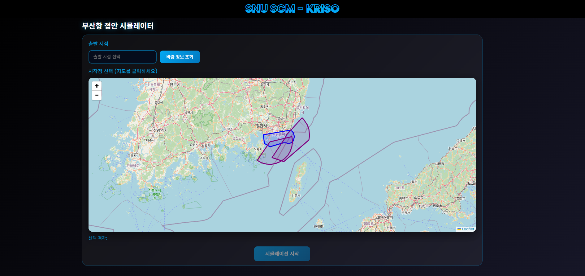
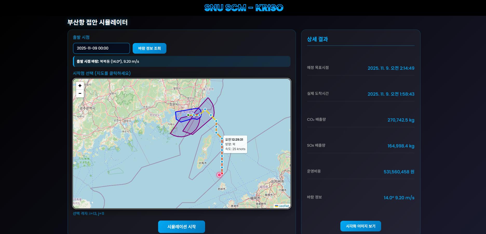

# 연료 소모량을 고려한 선박 운행 속도 최적화 모듈 개발

> SNU SCM × KRISO 외주 용역 산출물  
> **선박해양플랜트연구소 외주용역**

실제 부산항 해역 기반 / 풍향·풍속 영향 반영 / 강화학습 기반 항로 최적화 엔진

---

## 데모 서비스

**http://www.scm-kriso.cloud/**

---

## 사용자 화면

### ▶ 메인 화면



### ▶ 최적 항로 시각화 및 ETA·배출량·비용 상세 결과



---

## 소개

해운 규제 및 기상 불확실성을 반영하여 **심층 강화학습 기반 동적 선속 결정 알고리즘**과  
검증용 시뮬레이터를 설계·개발한 외주용역 프로젝트입니다.

부산항 주변 해상 격자 환경에서 풍속·풍향·지형·ECA/VSR 규제·연료비용·탄소배출 등을 고려하여  
최적 항로를 추천하는 시스템을 구축하고 웹 서비스로 배포했습니다.

- 웹 프론트엔드: Leaflet 기반 지도 UI
- 백엔드: Flask
- 시뮬레이션 엔진: 커스텀 강화학습 환경 (`environment.py`)
- 정책 추론: `main_inference.py`

---

## 기능 요약

### 지도 기반 시뮬레이션

- 지도를 클릭하여 시작 위치 선택
- 출발 시간과 기상청 API 기반 실시간 바람 정보 입력
- Drift·육지 충돌 회피 로직 적용
- 실제 지형 기반 ECA/VSRZ Overlay 표시

### 강화학습 기반 항로 계획

- Action: 8방향 × 속력
- 해상 풍향에 의한 불확실성 고려
- 육지 충돌 방지 자동 회피
- ETA 목적 시점 준수 및 연료·탄소 비용 최적화

### 시각화 및 분석

- 항로 polyline 표시
- 각 Segment를 속도에 따라 색상 시각화
- ETA 경과 시간 Tooltip
- CO₂·SOx 배출량, 비용 요약

### API

| 엔드포인트      | 기능                                             |
| --------------- | ------------------------------------------------ |
| `/docs`         | Swagger UI                                       |
| `/api/info`     | 서비스 메타데이터 및 엔드포인트 목록 반환        |
| `/api/health`   | 상태 정보 반환 (모델/설정/데이터 소스 상태 포함) |
| `/api/wind`     | 풍향/풍속 및 데이터 소스 반환                    |
| `/api/guidance` | 접안 가이던스 생성                               |

---

## Docker 실행

### 1. docker compose 사용

```bash
# 이미지 빌드 + 컨테이너 실행
docker compose up --build -d
```

- 브라우저 접속
- `KMA_API_KEY`는 `docker-compose.yml`의 environment 또는 `.env` 파일에서 설정

### 2. docker run 으로 직접 실행

```bash
# 이미지 빌드
docker build -t scm-kriso .

# 컨테이너 실행 (호스트 80 → 컨테이너 8000)
docker run -d \
  --name scm-kriso \
  -p 80:8000 \
  -e KMA_API_KEY=여기에_기상청_API_키_입력 \
  scm-kriso
```

---

## Tech Stack

`Python` `강화학습 (Deep RL)` `Flask` `Docker` `Leaflet` `기상청 API`
