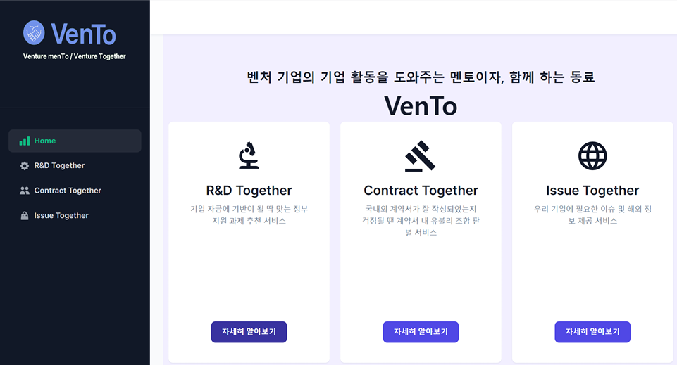
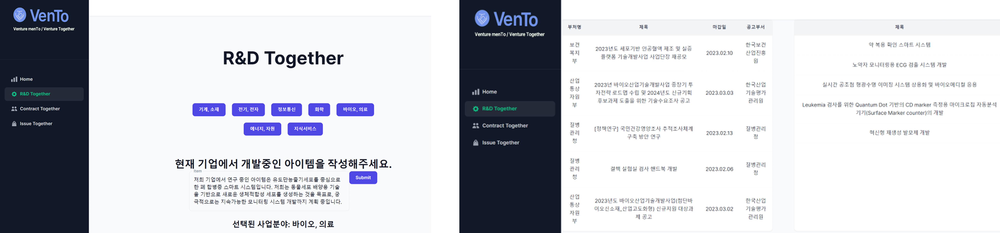
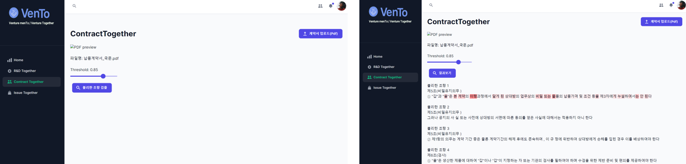

# KPMG Ideathon Challenge — VenTo

> YBIGTA × KPMG IDEATHON  
> **2023 KPMG IDEATHON CHALLENGE · 1위**


<div>


</div>

---

## 서비스 개요

벤처기업이 직면한 세 가지 현실적 한계를 해결하는 **AI 통합 지원 플랫폼 VenTo**를 기획·개발했습니다.

<p align="left">
  
</p>

```
자금 조달의 어려움        →  R&D Together   (정부 R&D 과제 매칭)
법률 조항 처리의 어려움   →  Contract Together (계약서 독소 조항 탐지)
해외 진출의 어려움        →  Issue Together  (맞춤형 국내외 뉴스 제공)
```

---

## 서비스 상세

### 1. R&D Together

정부 지원 R&D 과제 공고와 벤처기업의 사업 내용을 매칭하여 자금 조달 기회를 자동으로 탐색합니다.

<p align="left">
  
</p>

- 모델: **[mDeBERTa-v3 (R&D 파인튜닝)](https://huggingface.co/rroyc20/RnD-base-tokenizer-mDeBERTa-v3-kor-further)** + **[ko-sbert-sts](https://huggingface.co/jhgan/ko-sbert-sts)**
- 기업 소개문과 R&D 과제 공고문 간 의미적 유사도 계산 후 최적 과제 추천

### 2. Contract Together

계약서 내 독소 조항을 자동으로 탐지하고 경고합니다.

<p align="left">
  
</p>

- 모델: **[mDeBERTa-v3 (Contract 파인튜닝)](https://huggingface.co/jhn9803/Contract-base-tokenizer-mDeBERTa-v3-kor-further)**
- 계약서 문장 단위 분류 → 위험 조항 하이라이팅

### 3. Issue Together

국내외 뉴스를 벤처기업 맞춤형으로 큐레이션하고, 해외 진출 지원 사업 정보를 함께 제공합니다.

<p align="left">
  
</p>

- 모델: **[all-MiniLM-L6-v2](https://huggingface.co/sentence-transformers/all-MiniLM-L6-v2)** + **[bart-large-mnli](https://huggingface.co/facebook/bart-large-mnli)**
- 뉴스 임베딩 기반 유사도 랭킹 + Zero-shot Classification으로 카테고리 분류

---

## 시스템 구조

```
Frontend (React / Next.js)
        ↓
Backend (Flask API)
  ├── R&D 매칭 모델 서빙
  ├── Contract 독소 조항 탐지 모델 서빙
  └── Issue 뉴스 큐레이션 모듈
        ↓
뉴스 수집 배치 (newsproject/)
  ├── get_news.py       — 뉴스 크롤링
  ├── store_yesterday_news.py  — 일별 적재
  └── GitHub Actions 기반 자동화
```

---

## How to Run

```bash
git clone https://github.com/SEJEONGKANG/KPMG-VenTo.git
```

**Frontend**

```bash
# ~/KPMG-VenTo/frontend
npm install --legacy-peer-deps
npm run dev
```

**Backend (macOS)**

```bash
# ~/KPMG-VenTo/backend
python -m venv venv
source venv/bin/activate
pip install -r requirements.txt
flask run
```

**Backend (Windows)**

```bash
# ~/KPMG-VenTo/backend
python -m venv venv
.\venv\Scripts\activate
pip install -r requirements.txt
flask run
```

> 모델 파일(`torchs/`)은 [Google Drive](https://drive.google.com/drive/folders/1518Vy7GTzgbM64BTmWpdYPhAu_B0uumZ?usp=sharing)에서 다운로드 후 `KPMG-VenTo/backend/torchs/`에 추가

로컬 서버: http://localhost:3000

---

## Team

| 이름   | GitHub                                               | 역할                                         |
| ------ | ---------------------------------------------------- | -------------------------------------------- |
| 강세정 | [@SEJEONGKANG](https://github.com/SEJEONGKANG)       | Lead, Contract Together 모델링               |
| 김지효 | [@Jihyozhixiao](https://github.com/Jihyozhixiao)     | R&D Together 모델링 & 디자인                 |
| 나준호 | [@junho328](https://github.com/junho328)             | Contract Together 모델링 & 웹 백엔드(Flask)  |
| 박유찬 | [@chanchanuu](https://github.com/chanchanuu)         | Issue Together 모델링 & 웹 프론트엔드(React) |
| 안준우 | [@anjunwoo990809](https://github.com/anjunwoo990809) | Issue Together 모델링 & 웹 백엔드(DB)        |
| 장동현 | [@rroyc20](https://github.com/rroyc20)               | R&D Together 모델링 & 웹 프론트엔드(React)   |

---

## Tech Stack

`Python` `PyTorch` `mDeBERTa-v3` `ko-SBERT` `Flask` `React` `Next.js` `GitHub Actions`
