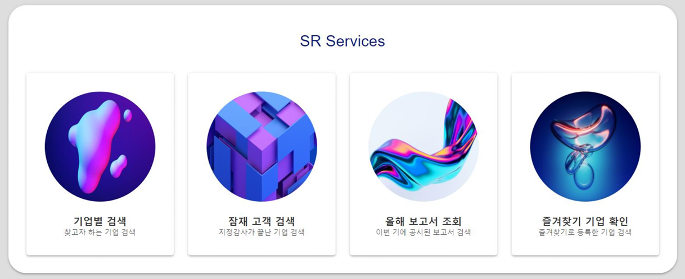
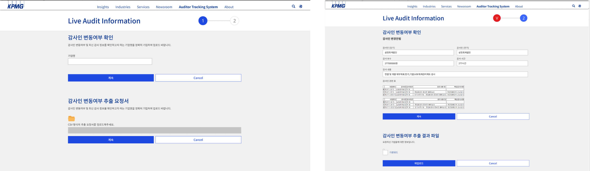
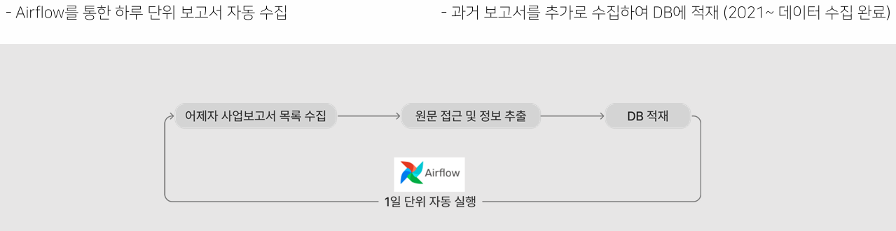
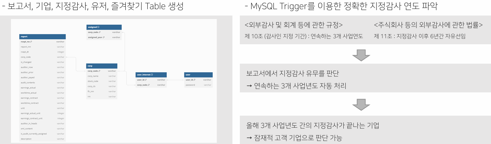
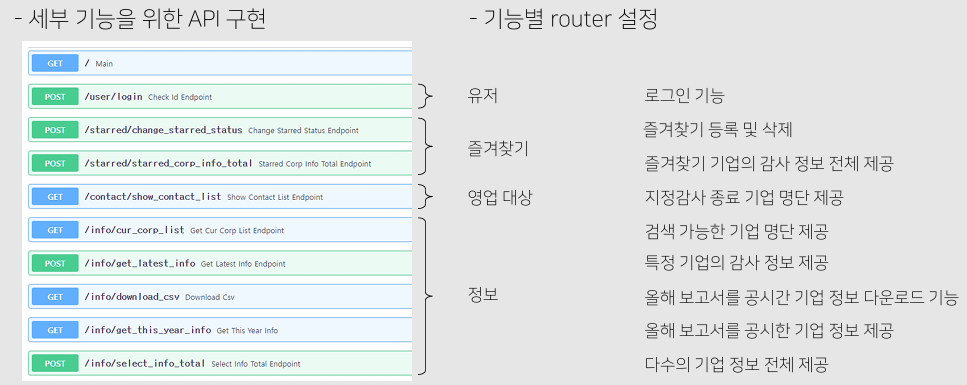
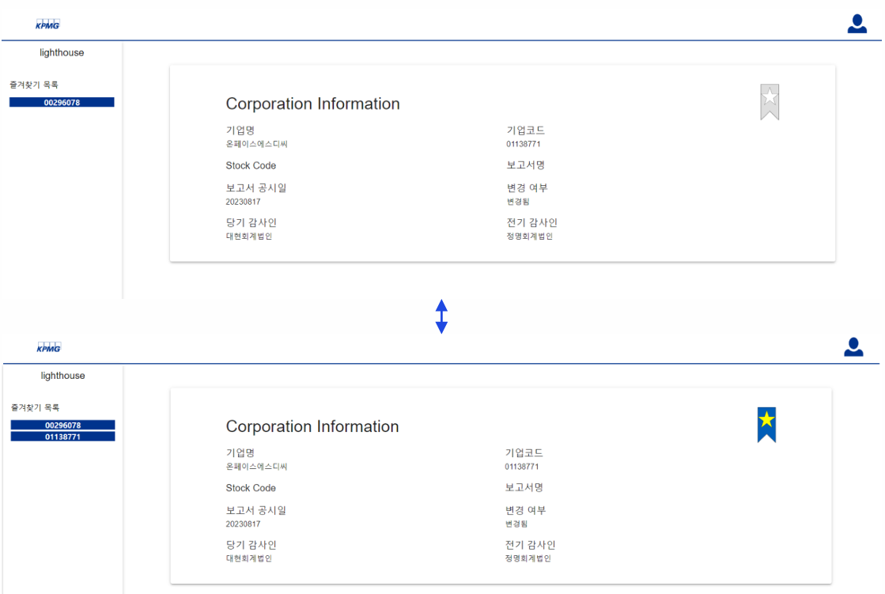

# KPMG Intern — 감사인 변경여부 추출

> 삼정KPMG 하계 인턴십  
> **상장사 대상 회계감사인 변경 여부 자동 추출 웹 서비스**


<details>
  <summary>메인 화면 확인</summary>
  <br>
  
</details>

<p align="left">
  
</p>

[DART](https://dart.fss.or.kr/) 공시 데이터를 기반으로 상장사의 감사인 변경 여부를 자동으로 판별하고,  
금융감독원 **지정감사** 해당 여부까지 분류하여 잠재 감사 타깃 기업을 웹에서 조회할 수 있는 파이프라인을 구축했습니다.

---

## 시스템 개요

```
DART OpenAPI → XML 보고서 파싱
        ↓
Apache Airflow (일별 배치 자동화)
        ↓
MySQL (감사인 변경 이력 + 지정감사 여부 저장)
        ↓
FastAPI 백엔드
        ↓
React 프론트엔드 (잠재 타깃 기업 조회 웹)
```

---

## 데이터 파이프라인

### Apache Airflow — 일별 자동화

<p align="left">
  
</p>

- 매일 전일자 DART 공시 데이터를 자동 수집 및 XML 파싱
- DAG 활성화 → XML 내용 처리 → MySQL 적재까지 일괄 처리
- 과거 데이터 일괄 수집 필요 시: [`main_past_data.py`](https://github.com/SEJEONGKANG/Extract-audit-opinion/blob/main/batch/dags/main_past_data.py) 실행

### MySQL — 데이터베이스

<p align="left">
  
</p>

- 데이터 적재 시 트리거 자동 실행 → 해당 보고서 연도의 지정감사 여부 판별 후 저장

### FastAPI — API 서버

<p align="left">
  
</p>

| 라우터               | 역할                          |
| -------------------- | ----------------------------- |
| `analysis_router.py` | 기업 분석 관련 API            |
| `contact_router.py`  | 잠재 고객(타깃 기업) 관리 API |
| `info_router.py`     | 기업 정보 조회 API            |
| `starred_router.py`  | 북마크 관련 API               |
| `user_router.py`     | 로그인·사용자 관리 API        |

---

## 감사인 변경 판별 로직

```
보고서 내 감사인 관련 테이블 전체 추출
        ↓
헤더 유무 확인 → "auditor" 컬럼 포함 여부 판단
        ↓
첫 번째 테이블에서 당기·전기·전전기 감사인 추출
        ↓
당기 감사인 == 전기 감사인 여부 비교 → 변경 여부 판별
        ↓
NER(xlm-roberta-large) 기반 지정감사 키워드 탐지
("11조", "증권선물위원회", "금융감독원", "지정감사", "상장" 등 — 외부감사법 기준)
        ↓
3개년 감사인 동일 + 지정감사 이력 존재 → 잠재 타깃 기업 분류
```

---

## 즐겨찾기 기업 등록/해제

<p align="left">
  
</p>

---

## How to Use

1. Docker Desktop 설치 및 실행 ([다운로드](https://www.docker.com/products/docker-desktop/))

2. 레포지토리 클론

```bash
gh repo clone kic-sr/Extract-audit-opinion
```

3. `/batch` 디렉토리에서 Airflow 이미지 빌드

```cmd
docker build -t sr_airflow_image .
```

4. 루트 디렉토리로 이동 후 Docker Compose 실행

```cmd
docker-compose up -d
```

---

## Team

| 이름   | 역할                                    |
| ------ | --------------------------------------- |
| 강세정 | 데이터 파이프라인, 백엔드, 데이터베이스 |
| 장동현 | 판별 로직 설계, 프론트엔드              |

---

## Tech Stack

`Python` `FastAPI` `React` `MySQL` `Apache Airflow` `Docker` `PyTorch` `NER (xlm-roberta)` `DART OpenAPI`
