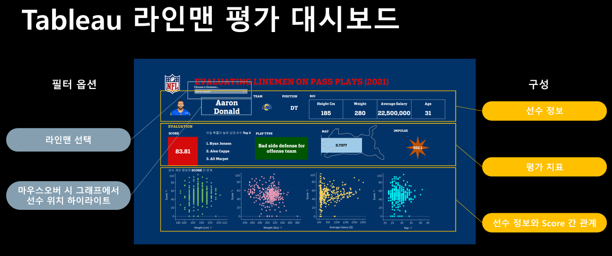
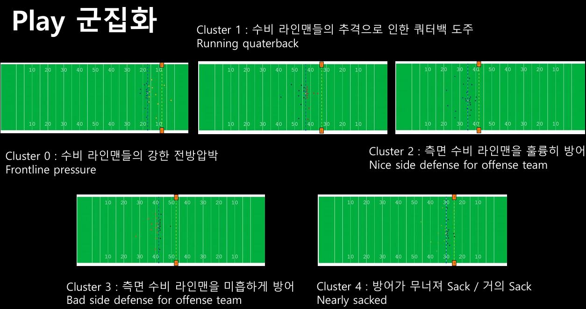

# NFL 패스플레이에서의 라인맨 평가

> YBIGTA 21기 DA 주니어 프로젝트 · NFL Big Data Bowl 2023

<p align="left">
  
</p>

패스 플레이에서 라인맨을 평가하는 **새로운 지표(Relative Scoring)**를 제안하고,  
Play 군집화를 통해 전략 유형별 맞춤 선수 교체 의사결정을 지원하는 분석 파이프라인을 설계했습니다.

---

## 문제 정의

기존 라인맨 평가 지표는 Sack 횟수에 의존하지만, 이는 실제 경기에서 라인맨이 쿼터백을 얼마나 효과적으로 압박했는지를 반영하지 못합니다.  
**"중요한 것은 앞에 있는 사람을 이길 수 있느냐"** — 라인맨의 성적은 상대평가여야 합니다.

---

## 프로젝트 흐름

```
01 데이터 분석         02 전략 수립              03 데이터 가공             04 시각화
5 Tables           Relative Versus        상대전적 Table 생성      Tableau
EDA + Plotly       Table establish        MAT(최대 운동량) 계산    Dashboard
인터랙티브 애니메이션                          Play 군집화(K-means)
```

---

## 방법론

### 1. EDA & 애니메이션 시각화

- 5개 테이블(Games, Players, Plays, PffScouting, Week), 8,557개 play 분석
- Play Description 파싱으로 passResult·playResult 추출
- **Plotly Interactive Animation**: 각 play의 22명 선수 움직임을 필드 위에 프레임별로 시각화

### 2. Relative Scoring

- Frame 1(초기 상태) 기준, 가장 가까운 상대 lineman 1:1 매칭
- 이후 프레임 진행 중 Defensive/Offensive Lineman의 **x좌표가 역전**될 경우 Defensive 승리 판정
- Sack 여부 및 패스 결과에 따라 점수 차등 부여
- Offensive/Defensive 간 포지션별 점수 유불리 → **평균 50점으로 Scaling** 통일

### 3. 데이터 가공

- 상대전적 Table 생성 → 선수별 Score & 전적 우세 상대 Top 3 추출
- **최대 운동량(MAT)**: 체중 × 최대 속력 → 멧돼지 기준(75kg × 16m/s = 1 MAT)으로 정규화

### 4. Play 군집화

<p align="left">
  
</p>

PCA + K-means(n=5)를 적용하여 8,557개 play를 5가지 전략 유형으로 분류했습니다.

| Cluster | 명칭                               | 특징                             |
| ------- | ---------------------------------- | -------------------------------- |
| 0       | Frontline pressure                 | 수비 라인맨들의 강한 전방 압박   |
| 1       | Running quarterback                | 수비 추격으로 인한 쿼터백 도주   |
| 2       | Nice side defense for offense team | 측면 수비 라인맨을 훌륭히 방어   |
| 3       | Bad side defense for offense team  | 측면 수비 라인맨을 미흡하게 방어 |
| 4       | Nearly sacked                      | 방어가 무너져 Sack 직전 상황     |

### 5. Tableau 대시보드

선수 선택 시 Score, 전적 우세 상대 Top 3, MAT, 충격량, Play Type을 한눈에 확인할 수 있는 인터랙티브 대시보드를 구성했습니다.

[](https://public.tableau.com/app/profile/eunsuh.kim/viz/-EvaluatingLinemenonPassPlays/EvaluatingLinemenonPassPlays2021?publish=yes)

---

## 결과 및 의의

- 상대 선수 및 원하는 전략 유형에 맞는 **최적 라인맨 교체** 의사결정 지원
- Play 군집화로 동일한 Shotgun 전략 내에서도 상황별 분류 가능
- → Play 승리 확률 및 최종 게임 승리 확률 향상에 기여

---

## Team

강세정, 김은서, 박유찬, 장동현

---

## Tech Stack

`Python` `Plotly` `K-means` `PCA` `Tableau`

---

## 파일 구성

| 파일                                   | 설명              |
| -------------------------------------- | ----------------- |
| `NFL 패스플레이에서의 라인맨 평가.pdf` | 프로젝트 발표자료 |
