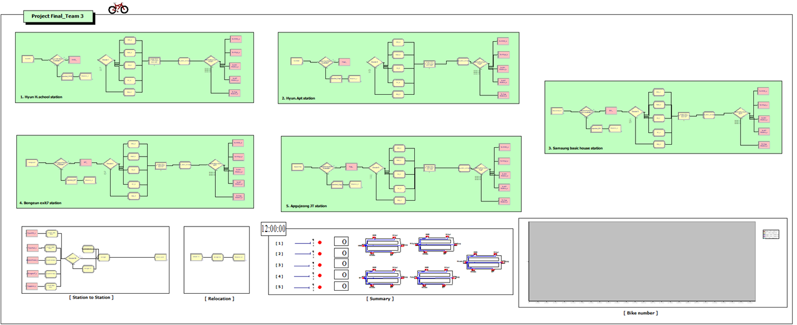
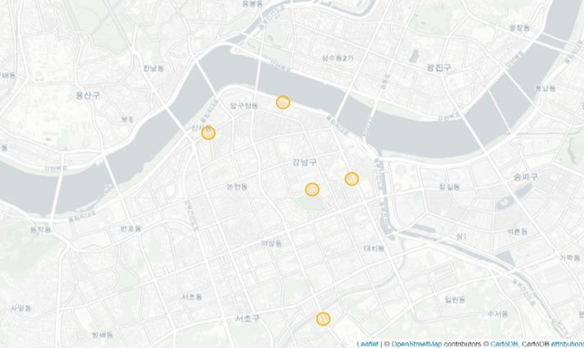

# 강남구 따릉이 대여소 최적화

> 시뮬레이션 팀 프로젝트

  

따릉이 이용자 수는 매년 증가하지만 적자폭은 심화되는 상황에서,  
**Arena 시뮬레이션**을 활용해 강남구 대여소 철거 시 수익성·서비스·CO₂ 영향을 정량적으로 비교 분석했습니다.

---

## 배경

- 따릉이 이용 건수 연 9165만 건(2021), 회원 330만 명에도 불구하고 **2021년 적자 -103억 원**
- 전국 2,600곳 이상의 대여소가 포화 상태
- 통행 방해·안전 문제로 인한 **대여소 철거 민원** 심화

→ 대여소 철거와 자전거 대수 조정을 통한 수익성 최적화 필요

---

## 목적함수

$$\text{MAX Total Profit} = \text{Ticket Earned} + \text{CO}_2 \text{ save cost}$$
$$- \text{Bike maintenance cost} - \text{Relocation Worker Salary} - \text{Additional Walking cost} - \text{Disappointment cost}$$

---

## 방법론

### 1. 대상 대여소 선정

강남구 전체 159곳 대여소를 **이용횟수 기준 5개 클러스터**로 분류하고, 각 클러스터 대표 대여소 1곳씩 선정:

  

| #   | 대여소명            | 약칭 |
| --- | ------------------- | ---- |
| 1   | 현대고등학교 앞     | HHS  |
| 2   | 현대아파트          | Hapt |
| 3   | 삼성동 베이직하우스 | SH   |
| 4   | 봉은사역 7번출구    | B7   |
| 5   | 압구정나들목        | Apg  |

### 2. 데이터

서울시 공공데이터포털 (2021.06 ~ 2022.06):

- 대여소 정보(명칭, 위치, 거치 대수)
- 이용건별 데이터(대여소, 반납대여소, 이용시간, 이동거리)
- 고장신고 내역

### 3. Arena 시뮬레이션 모델링

- **5개 station 간 25가지 route** 전부 모델링
- 도착 확률: 연간 사용이력 데이터 기반 계산
- 고장: NORM(7.42, 2.97) 분포, Down time 6시간
- Runtime: **4,416시간(6개월)**, 10회 replication
- 대여소 철거 시: 50% 가장 가까운 대여소 이동, 50% reject

---

## 결과

| 시나리오   | Total Profit     |
| ---------- | ---------------- |
| Base model | -₩17,468,919     |
| no HHS     | -₩30,997,211     |
| no Apg     | -₩29,522,880     |
| no B7      | -₩21,004,332     |
| no Hapt    | -₩18,534,813     |
| **no SH**  | **-₩16,731,037** |

- **SH(이용률 최저) 대여소 철거 시**: 수익성·Rejection·CO₂ 모두 가장 합리적
- 다른 대여소 철거 시 수익성 오히려 악화
- 대여소 사용빈도와 철거 시 절약 비용은 **반비례**

### 대여소별 따릉이 대수 최적화

OptQuest 기반 최적화 결과:

- Hapt: **6대 감축**
- SH: **5대 감축**

---

## 결론

대여소 철거를 통한 수익 개선 가능성 확인, 그리고 **대여소 사용빈도와 철거 절약 비용의 반비례 관계** 도출.  
강남구 일부 대여소뿐만 아니라 서울시 전체 사업에 적용 및 수익 개선 가능성이 있습니다.

---

## Team

강세정, 국호연, 김경진, 문지성, 박진호, 유동준

---

## Tech Stack

`Python` `Arena` `서울시 공공데이터포털`

---

## 파일 구성

| 파일/폴더                        | 설명                                                                                  |
| -------------------------------- | ------------------------------------------------------------------------------------- |
| `PPT.pdf`                        | 프로젝트 발표자료                                                                     |
| `Report.pdf`                     | 프로젝트 보고서                                                                       |
| `data/data 전처리 및 가공.ipynb` | 공공데이터 전처리 코드                                                                |
| `data/route time/`               | Arena Input Analyzer 입력 데이터 (25개 route별 이용 시간 CSV)                         |
| `모델/`                          | Arena 시뮬레이션 모델 파일 (.DOE) — base, no hhs, no hapt, no SH, no B7, no apgujeong |
