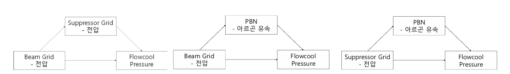

# 인과적 추론을 활용한 반도체 식각 공정에서의 고장 해석

> 인과적 추론 개인 프로젝트

<p align="left">
  
</p>

PHM Data Challenge 2018 데이터를 활용하여, 이온 밀링 식각 장치의 **고장 원인을 인과 추론으로 해석**했습니다.  
단순 예측(Decision Tree)과 달리, 인과 매개 분석을 통해 **근원 부품 특정 및 교체 우선순위 의사결정**까지 지원합니다.

---

## 문제 정의

반도체 이온 밀링 식각 기기(03_M02)에서 FlowCool 압력 관련 3가지 고장 유형이 관측됩니다.  
고장 발생 시 **어떤 부품을 먼저 점검해야 하는가?** — 이를 인과 추론으로 답합니다.

---

## 데이터

- 출처: PHM Data Challenge 2018 (이온 밀링 식각 장치 센서 시계열)
- 변수: 13개 센서 변수(빔 그리드 전압·전류, 서프레서 전압·전류, PBN, Flowcool 압력 등) + 고장 유형
- 분석 대상: `FLOWCOOLPRESSURE` (Outcome)

---

## 방법론: Causal Mediation Analysis

단순 상관관계가 아닌 **인과 매개 경로**를 분리하여 고장의 메커니즘을 파악합니다.

```
Exposure (원인 변수)
      ↓  직접 효과 (Direct Effect)
      ↓  매개 효과 (Mediated Effect via Mediator)
Mediator → Outcome (FLOWCOOLPRESSURE)
```

- **Confounder**: recipe (장치 세팅 종류)
- **R package**: `mediation`
- Sensitivity Analysis 수행으로 결과의 강건성 검증

### 분석한 5가지 인과 경로

| Exposure           | Mediator      | Outcome           |
| ------------------ | ------------- | ----------------- |
| 빔 그리드 전압     | 서프레서 전압 | Flowcool 압력     |
| 빔 그리드 전압     | 서프레서 전류 | Flowcool 압력     |
| **빔 그리드 전압** | **PBN**       | **Flowcool 압력** |
| 서프레서 전압      | PBN           | Flowcool 압력     |
| 서프레서 전류      | PBN           | Flowcool 압력     |

---

## 결과

유의미한 Mediated Effect Proportion 순위:

| 인과 경로                       | Mediated Effect Proportion |
| ------------------------------- | -------------------------- |
| 빔 그리드 → PBN → Flowcool      | **0.6569**                 |
| 빔 그리드 → 서프레서 → Flowcool | 0.5067                     |
| 서프레서 → PBN → Flowcool       | 0.1874                     |

→ **빔 그리드 전압이 PBN을 매개하여 Flowcool 압력에 가장 큰 영향**을 미칩니다.

### Decision Tree와의 비교

| 방법론                    | 장점                               | 한계                                         |
| ------------------------- | ---------------------------------- | -------------------------------------------- |
| Decision Tree (MSE 0.004) | 예측 정확도 높음                   | 고장 발생 시 어느 부품이 원인인지 알 수 없음 |
| Causal Mediation Analysis | **근원 부품(빔 그리드) 특정 가능** | 복잡한 비선형 관계 포착 어려움               |

→ 고장 발생 시 빔 그리드를 우선 교체하는 **정량적 의사결정 근거** 제공

---

## Tech Stack

`R` `mediation` `Python` `Decision Tree`

---

## 파일 구성

| 파일                                                        | 설명                  |
| ----------------------------------------------------------- | --------------------- |
| `causal inference.R`                                        | 인과 매개 분석 R 코드 |
| `인과적 추론을 활용한 반도체 식각 공정에서의 고장 해석.pdf` | 프로젝트 보고서       |
