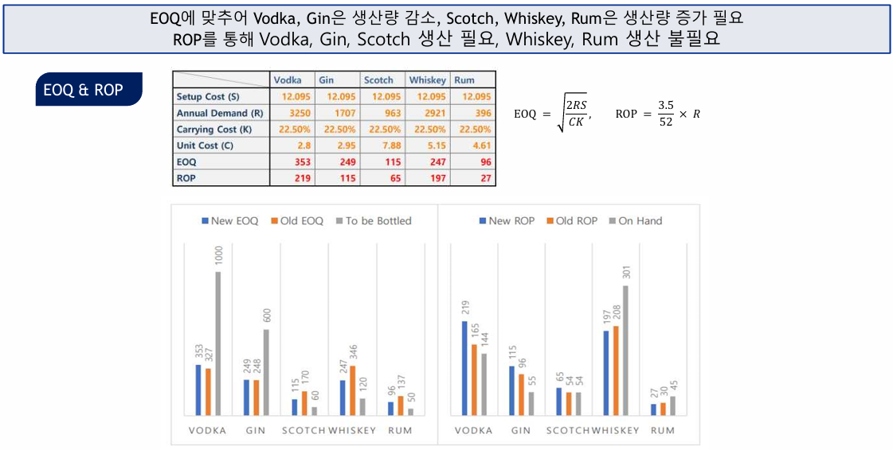

# 재고관리 Case Study — Blanchard Importing and Distributing Co., Inc.

> 재고관리 수업 케이스 스터디

  

주류 제조·유통사 Blanchard사의 실제 데이터를 바탕으로 **EOQ/ROP 시스템을 재산정**하고,  
기존 시스템의 한계를 진단하며 수요의 계절성을 반영한 **재고관리 전략 개선안**을 제시했습니다.

---

## 문제 정의

Blanchard사는 Vodka, Gin, Scotch, Whiskey, Rum 5개 주류를 생산합니다.  
1971~1972년 데이터로 구축된 EOQ 시스템이 현재 상황에 맞는지 재검토하고, 보다 현실적인 생산계획 수립 방안을 탐구합니다.

---

## 방법론

### 1. EOQ & ROP 재계산

1971.6 ~ 1972.5 데이터를 기반으로 파라미터를 재산정했습니다.

$$EOQ = \sqrt{\frac{2RS}{KC}}$$

| 파라미터 | 설명                          | 값                                                                |
| -------- | ----------------------------- | ----------------------------------------------------------------- |
| R        | 연간 수요                     | Vodka 3,250 / Gin 1,707 / Scotch 963 / Whiskey 2,921 / Rum 396    |
| S        | Setup Cost (Label Changeover) | $12.095                                                           |
| C        | Unit Cost (생산 중 발생 비용) | Vodka $2.8 / Gin $2.95 / Scotch $7.88 / Whiskey $5.15 / Rum $4.61 |
| K        | Carrying Cost                 | Hurdle Rate 20% + 기타 2.5% = **22.5%**                           |

결과: Vodka·Gin 생산량 감소, Scotch·Whiskey·Rum 생산량 증가 필요

### 2. 기존 시스템 한계 분석

**기존 EOQ system의 한계:**

- 수요 비일정, 재고부족 가능성, 고정 Q 운영 불가
- 비용구조 변동 미반영, 데이터 미업데이트, 리드타임 미고려

**Bob & Eliot system의 한계:**

- 불안정한 수요예측 → 높은 Holding/Penalty cost
- Size change 비용 절감 위한 단일 크기 생산 → 불필요한 비용 발생
- 라벨 교체 유휴시간 비효율

### 3. 계절성 분석

시도표, Seasonal Factor, 분해법(Fs), D8 F검정을 통해 계절 주기를 확인했습니다.

| 제품   | 계절 주기 | Seasonal Factor |
| ------ | --------- | --------------- |
| Vodka  | 4개월     | 0.77            |
| Scotch | 4개월     | 0.70            |
| Rum    | 4개월     | 0.87            |

---

## 개선 방안

- **Lot size reorder point system** 도입
- 수요 Trend/Seasonality 고려한 예측 모형 적용 (이동평균, Winter's Method, **SARIMA**)
- 라벨 교체 장비 교체를 통한 시스템 효율화
- Warehouse layout 변경
- 판매 종류 축소 및 수익성 높은 소매점 확대

---

## Tech Stack

`R` `Excel`

---

## 파일 구성

| 파일         | 설명              |
| ------------ | ----------------- |
| `PPT.pdf`    | 프로젝트 발표자료 |
| `Report.pdf` | 프로젝트 보고서   |
