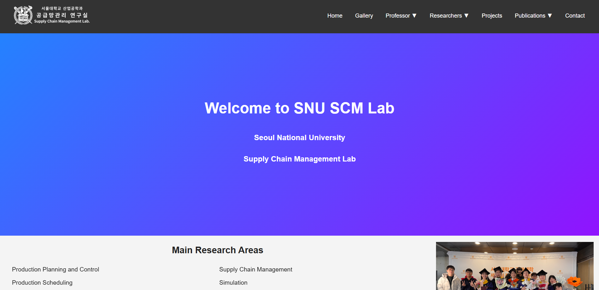

# SNU SCM 홈페이지 개편

> 서울대학교 산업공학과 SCM Lab 홈페이지 구조 개편 및 웹 페이지 구현

> 홈페이지: http://scm.snu.ac.kr/

<p align="left">
  
</p>

<div>
  
  
  
  
</div>

서울대학교 SCM Lab 홈페이지를 연구실 소개용 웹사이트 형태로 정리하고,  
메뉴 구조와 콘텐츠 페이지를 일관된 방식으로 구성했습니다.

---

## 서비스 개요

기존 연구실 홈페이지는 정보 접근성과 탐색 구조 측면에서 개선 여지가 있었고,  
이를 보완하기 위해 연구실 방문자 관점에서 필요한 정보를 메뉴 중심으로 재구성했습니다.

**SNU SCM 홈페이지 개편** 프로젝트는  
연구실 소개, 구성원, 프로젝트, 출판물, 갤러리, 연락처 정보를  
직관적으로 탐색할 수 있도록 정보 구조를 재설계하고,  
이를 실제 웹 페이지로 구현한 프로젝트입니다.

---

## 디렉토리 구조

```bash
SNU SCM 홈페이지 개편
├── contact/
├── gallery/
├── professor/
├── projects/
├── publications/
├── researchers/
├── src/
├── footer.asp
├── index.asp
├── navbar.asp
├── script.js
├── styles.css
└── web.config
```

- `contact/` : 연락처 관련 페이지
- `gallery/` : 갤러리 페이지
- `professor/` : 교수 소개 페이지
- `projects/` : 프로젝트 소개 페이지
- `publications/` : 출판물 페이지
- `researchers/` : 연구원 소개 페이지
- `src/` : 기타 리소스 파일
- `footer.asp` : 공통 푸터 컴포넌트
- `index.asp` : 메인 페이지
- `navbar.asp` : 공통 내비게이션 바
- `script.js` : 클라이언트 스크립트
- `styles.css` : 전역 스타일시트
- `web.config` : 웹 서버 설정 파일

---

## Tech Stack

`Classic ASP` `HTML` `CSS` `JavaScript`
