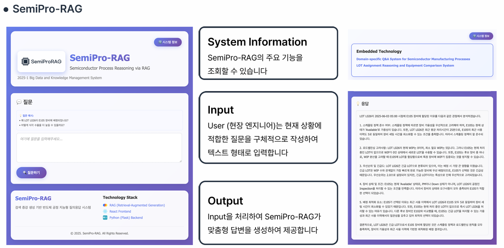
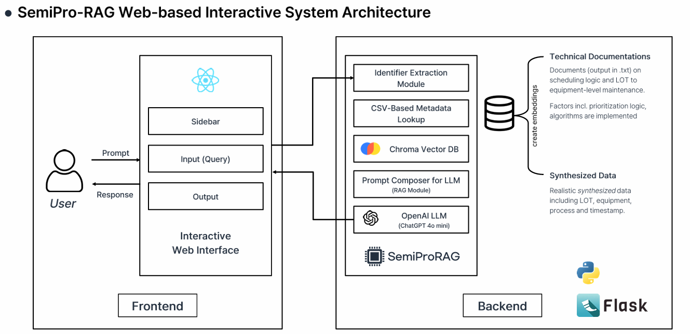
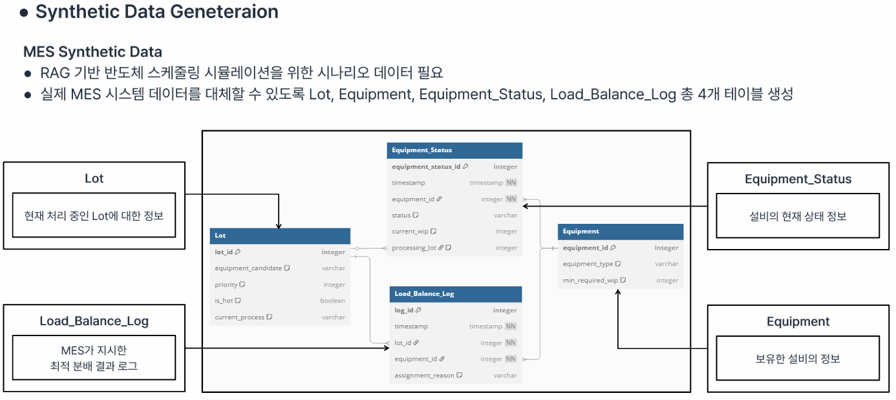

# SemiPro-RAG — RAG를 이용한 반도체 공정 추론

> 데이터사이언스 응용을 위한 빅데이터 및 지식 관리 시스템
> **반도체 제조 문서와 구조화 데이터를 활용한 공정 질의응답 시스템**

<p align="left">
  
</p>

<div>
  
  
  
  
  
  
</div>

---

## 서비스 개요

반도체 제조 현장에서는 공정, 설비, LOT, 레시피, 작업 이력처럼  
서로 연결된 다양한 정보를 바탕으로 의사결정을 내려야 하는 경우가 많습니다.

**SemiPro-RAG**는 이러한 문제를 해결하기 위해,  
자연어 질의에서 핵심 식별자를 추출하고 구조화된 메타데이터와 기술 문서를 함께 참조하여  
설명 가능한 답변을 생성하는 **RAG 기반 반도체 공정 추론 시스템**입니다.

```text
공정/설비/LOT 정보 파악의 어려움      →  Identifier Extraction
구조화 데이터 조회의 필요              →  Metadata Lookup
기술 문서 기반 근거 확보               →  Document Retrieval
설명 가능한 답변 생성 필요             →  Grounded LLM Response
```

---

## 서비스 상세

### 1. Identifier Extraction

사용자 질의에서 LOT 번호, 장비명, 공정 식별자 등  
후속 검색과 추론에 필요한 핵심 엔티티를 추출합니다.

- 자연어 질문 내 도메인 핵심 식별자 분리
- LOT / 설비 / 공정 / 레시피 등 질의 핵심 대상 파악

### 2. Metadata Lookup

CSV 기반 구조화 데이터를 활용하여  
질문과 직접적으로 연결되는 공정, 설비, 작업 이력 정보를 조회합니다.

- CSV 기반 메타데이터 레코드 검색
- 질의와 관련된 구조화 정보 연결

### 3. Document Retrieval

기술 문서를 벡터 DB에 저장하고,  
질문과 의미적으로 관련성이 높은 문서를 검색합니다.

- **Chroma Vector DB** 기반 문서 검색
- 질의와 관련된 반도체 제조 문서 검색
- 검색 결과를 LLM 입력 근거로 활용

### 4. Grounded Response Generation

검색된 구조화 데이터와 문서 정보를 바탕으로  
LLM이 근거 기반의 설명 가능한 응답을 생성합니다.

- 프롬프트 내 메타데이터 + 문서 검색 결과 통합
- 단순 응답이 아닌 **이유와 맥락을 설명하는 형태의 답변** 생성

### 5. Web Interface

사용자가 프롬프트를 입력하고 응답을 확인할 수 있는  
웹 기반 상호작용 인터페이스를 제공합니다.

- 질문 입력
- 응답 결과 확인
- 대화형 질의응답 인터페이스 구성

---

## 시스템 구조

```text
User Query
   ↓
Identifier Extraction Module
   ↓
CSV-Based Metadata Lookup
   ↓
Chroma Vector DB (Document Retrieval)
   ↓
Prompt Composer for LLM
   ↓
OpenAI LLM
   ↓
Grounded Response
```

### 아키텍처

<p align="left">
  
</p>

**Frontend (React)**

- 사용자 질의 입력
- 응답 결과 확인
- 대화형 인터페이스 제공

**Backend (Flask)**

- 식별자 추출
- CSV 메타데이터 조회
- Chroma 기반 문서 검색
- 프롬프트 조합 및 LLM 호출

---

## 주요 기능

### 1. 질의 내 식별자 추출

사용자 질문에서 LOT 번호, 장비명, 공정 식별자 등  
추론에 필요한 핵심 엔티티를 자동으로 추출합니다.

### 2. 구조화 데이터 조회

CSV 기반 메타데이터를 활용해  
질문과 연결되는 공정/설비/작업 이력 정보를 조회합니다.

### 3. 문서 검색 기반 RAG

기술 문서를 벡터 DB에 저장하고  
질문과 관련성이 높은 문서를 검색하여 응답 생성에 활용합니다.

### 4. 설명 가능한 답변 생성

최종 출력은 단순 정답이 아니라  
왜 해당 판단이 도출되었는지 설명하는 형태의 응답을 목표로 합니다.

### 5. 웹 기반 인터페이스

사용자가 직접 질의를 입력하고 결과를 확인할 수 있는  
상호작용형 웹 서비스를 제공합니다.

---

## 데이터 생성

스케줄링 로직, 장비 할당 이력 등
실제로 구할 수 없는 데이터를 생성한 뒤 프로젝트를 진행했습니다.

<p align="left">
  
</p>

---

## 파일 구성

```bash
SemiPro-RAG_RAG를 이용한 반도체 공정 추론
├── src/
├── Semipro-RAG_발표자료.pdf
├── evaluation.csv
├── evaluation_db_only_score.csv
├── evaluation_semipro_score.csv
├── semipro.ipynb
└── semipro_db_only.ipynb
```

- `src/` : 시스템 구현 코드
- `Semipro-RAG_발표자료.pdf` : 프로젝트 발표 자료
- `evaluation.csv` : 전체 평가 결과
- `evaluation_db_only_score.csv` : DB 기반 비교 실험 결과
- `evaluation_semipro_score.csv` : SemiPro-RAG 평가 결과

---

## 기대 효과

이 프로젝트는 반도체 제조 도메인처럼  
구조화 데이터와 비정형 문서가 함께 존재하는 환경에서,  
LLM 기반 질의응답 시스템을 실제 업무 맥락에 맞게 어떻게 설계할 수 있는지를 보여줍니다.

특히 다음과 같은 점에서 의미가 있습니다.

- 범용 챗봇이 아닌 **도메인 특화형 RAG 시스템**
- 문서 검색뿐 아니라 **메타데이터 조회를 함께 활용**
- 결과를 **설명 가능한 형태**로 제공하려는 시도

---

## 배운 점

이 프로젝트를 통해 다음과 같은 내용을 직접 다룰 수 있었습니다.

- RAG 파이프라인 설계
- 도메인 지식을 반영한 질의 해석
- 벡터 DB를 활용한 문서 검색
- 프롬프트 구성과 LLM 응답 품질 개선
- 웹 인터페이스와 백엔드 추론 모듈 연결

LLM을 단독으로 사용하는 것보다,  
도메인 데이터와 검색 구조를 함께 설계하는 것이  
실제 응용에서 훨씬 중요하다는 점을 체감한 프로젝트였습니다.

---

## Tech Stack

`Python` `OpenAI API` `RAG`
