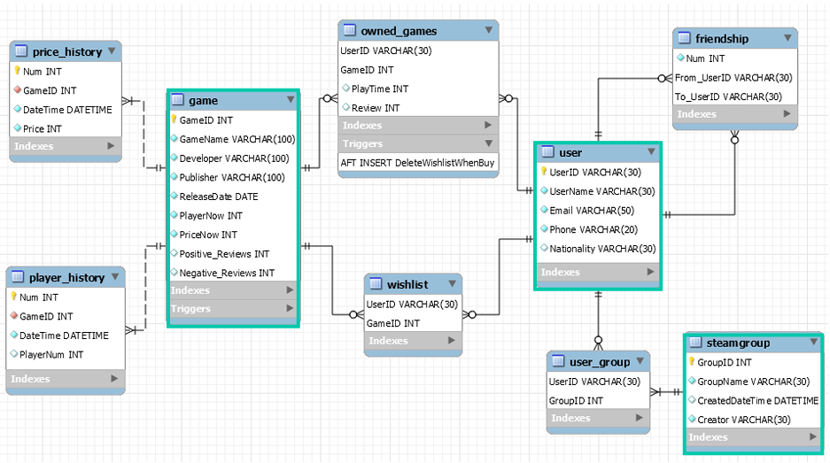

# SteamDB 구축

> 산업정보관리론 프로젝트  
> **Steam 데이터를 활용한 관계형 데이터베이스 설계 및 응용 서비스 구현**

<p align="left">
  
</p>

<div>
  
  
  
  
</div>

---

## 서비스 개요

Steam 플랫폼에는 게임, 유저, 친구 관계, 그룹, 가격, 플레이타임 등  
서로 긴밀하게 연결된 다양한 데이터가 존재합니다.

**SteamDB 구축** 프로젝트는 이러한 Steam 도메인 데이터를 바탕으로  
관계형 데이터베이스를 설계하고, 이를 활용한 검색·조회·추천 서비스를 구현한 프로젝트입니다.

단순히 테이블만 설계한 것이 아니라,  
**함수 / 저장 프로시저 / 뷰 / 서비스 시나리오**까지 함께 구성하여  
실제로 활용 가능한 데이터베이스 기반 서비스를 목표로 했습니다.

```text
Steam 도메인 데이터 구조화 필요         →  관계형 데이터베이스 설계
반복적인 조회 로직의 재사용 필요        →  Function / Procedure 구현
복합 지표 조회의 효율성 필요            →  View 구성
실제 서비스 활용 가능성 확보            →  검색 / 조회 / 추천 기능 구현
```

---

## 서비스 상세

### 1. Database Design

Steam 도메인을 구성하는 다양한 엔터티와 관계를 분석하여  
정규화된 관계형 데이터베이스 구조를 설계했습니다.

- 게임, 유저, 그룹, 친구 관계 등 핵심 엔터티 정의
- 개체 간 관계를 반영한 테이블 구조 설계
- ERD 기반 데이터 모델링 수행

### 2. SQL Logic Implementation

단순 조회를 넘어서 함수, 저장 프로시저, 뷰를 활용해  
재사용 가능한 SQL 로직을 구현했습니다.

- 핵심 지표 계산용 Function 작성
- 서비스 단위 기능을 위한 Stored Procedure 작성
- 복합 조회 편의를 위한 View 구성

### 3. Game Information Search

특정 게임에 대한 주요 정보를 통합적으로 조회할 수 있도록 구성했습니다.

- 기본 정보
- 현재 가격
- 역대 최저가
- 평소 가격
- 할인율
- 역대 최고 동시접속자 수
- 판매량
- 찜 수
- 유저 평점

### 4. User / Group Information Search

유저와 그룹 관련 정보를 종합적으로 확인할 수 있는 조회 기능을 구현했습니다.

- 유저 기본 정보 조회
- 보유 게임 및 플레이타임 조회
- 친구 관계 조회
- 그룹 구성원 및 관련 정보 조회

### 5. Recommendation Service

다양한 기준에 따라 게임 추천 결과를 제공하도록 설계했습니다.

- 친구들의 플레이타임 총합 기준 추천
- 현재 할인율 기준 추천
- 판매량 기준 추천
- 동시접속자 수 상승량 기준 추천
- 현재 동시접속자 수 기준 추천
- 유저 평점 기준 추천

---

## 주요 기능

### 1. 게임 정보 검색

특정 게임에 대해 가격, 할인율, 판매량, 평점, 동시접속자 수 등  
핵심 정보를 통합 조회할 수 있도록 설계했습니다.

### 2. 유저 정보 검색

유저의 기본 정보와 함께  
보유 게임, 플레이타임, 친구 관계, 그룹 정보를 종합적으로 확인할 수 있도록 구성했습니다.

### 3. 그룹 정보 검색

특정 그룹에 대해  
구성원 정보와 관련 데이터를 확인할 수 있도록 구현했습니다.

### 4. 추천 기능

여러 기준에 따라 서로 다른 성격의 게임 추천 결과를 제공하도록 설계했습니다.

---

## SQL 구현 요소

### Function

다음과 같은 핵심 지표 계산 함수를 구현했습니다.

- `GetLowestPrice`
- `GetHighestCCU`
- `GetTrendingCCU`
- `GetMostCommonPrice`
- `GetDiscountRate`
- `GetSalesRate`
- `GetDibsRate`

### Stored Procedure

서비스 단위 기능 구현을 위해 다음과 같은 프로시저를 작성했습니다.

- `ShowGameIntroduction`
- `ShowGameRecommend`
- `ShowProfile`
- `ShowGroupIntroduction`

### View

조회 편의성과 재사용성을 높이기 위해  
핵심 지표를 뷰(View) 형태로 정리했습니다.

---

## 프로젝트 결과

이 프로젝트의 강점은 단순 DB 설계에 그치지 않고,  
실제 서비스 시나리오와 연결되는 형태로 확장했다는 점입니다.

예를 들어 게임 검색 화면에서는  
기존 서비스가 충분히 보여주지 않는 정보까지 포함하도록 설계했습니다.

- 평소 가격
- 전일 대비 동시접속자 수 상승량
- 판매량
- 찜 수

또한 추천 화면에서는 다양한 기준을 바꿔가며  
다른 성격의 게임을 탐색할 수 있도록 구성했습니다.

---

## 파일 구성

```bash
SteamDB 구축
├── DATA 파일/
├── SQL 파일/
├── DB 구축 보고서.pdf
├── PPT 파일.pdf
├── README.md
└── 사용 설명서.pdf
```

- `DATA 파일/` : 프로젝트에 사용한 원천 데이터
- `SQL 파일/` : 테이블, 함수, 프로시저, 뷰 등 SQL 구현 파일
- `DB 구축 보고서.pdf` : 데이터베이스 설계 보고서
- `PPT 파일.pdf` : 발표 자료
- `사용 설명서.pdf` : 기능 실행 및 사용 방법 정리

---

## 기대 효과

이 프로젝트는 Steam과 같은 복합 플랫폼 데이터를  
관계형 구조로 체계화하고, 이를 실제 서비스 기능과 연결하는 방법을 보여줍니다.

특히 다음과 같은 점에서 의미가 있습니다.

- Steam 도메인을 반영한 **관계형 데이터베이스 설계**
- 함수 / 프로시저 / 뷰를 활용한 **재사용 가능한 SQL 로직 구성**
- 조회 기능을 넘어 추천 기능까지 포함한 **서비스 지향적 DB 활용**

---

## 배운 점

이 프로젝트를 통해 다음과 같은 내용을 실습할 수 있었습니다.

- 도메인 분석을 바탕으로 한 ERD 설계
- 관계형 데이터베이스 정규화
- 함수 / 프로시저 / 뷰를 활용한 SQL 로직 구성
- 데이터베이스를 서비스 기능과 연결하는 방법
- 사용자 입장에서 유용한 조회 기준을 정의하는 방법

단순히 데이터를 저장하는 것보다,  
어떤 방식으로 구조화하고 어떤 질의를 지원할 것인지가  
데이터베이스 설계에서 매우 중요하다는 점을 배울 수 있었습니다.

---

## Tech Stack

`MySQL` `SQL` `Relational Database` `ERD`
